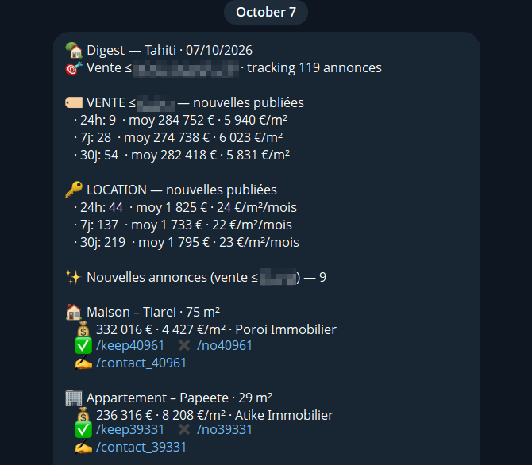
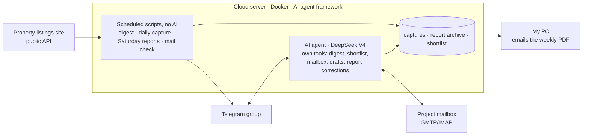
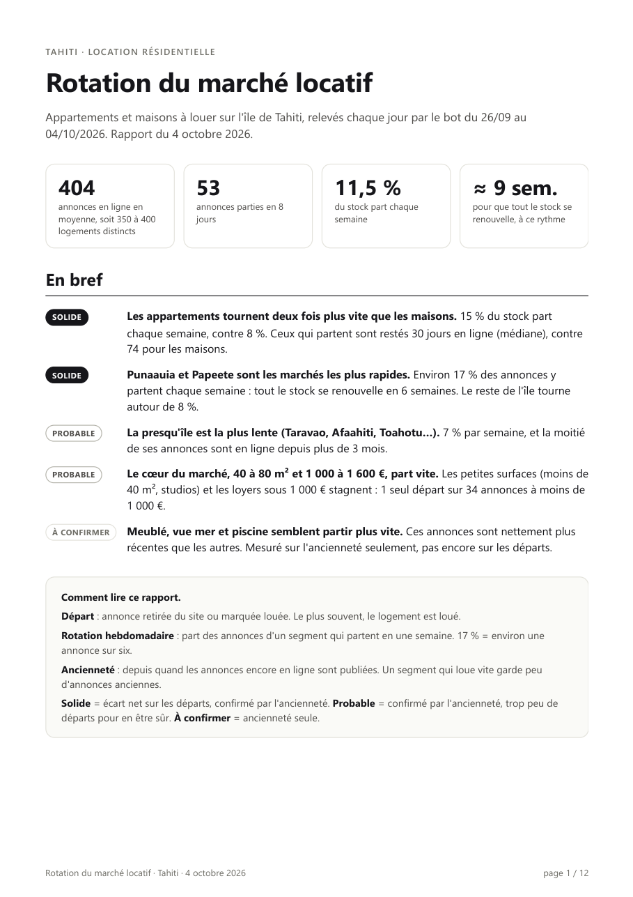
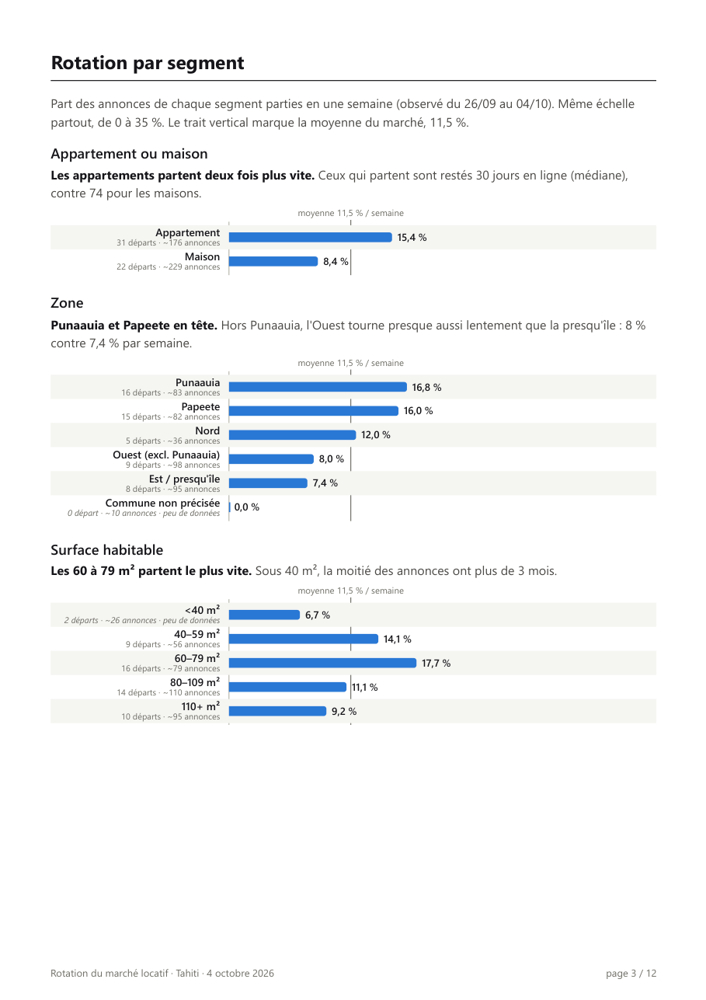
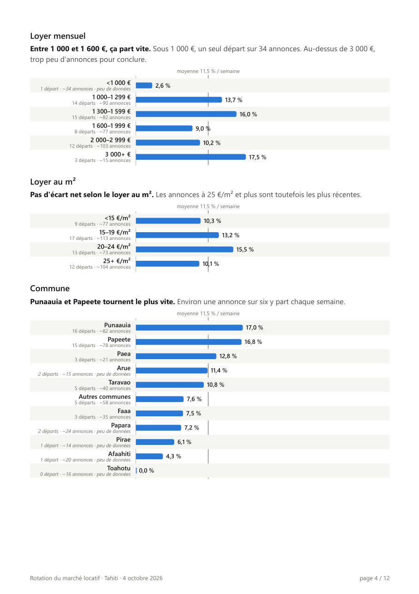

# Property Market Intelligence: Tahiti

## Objective
 
My goal was to understand the Tahitian property market and its dynamics: which properties are listed, how long they stay on the market, and which segments (location, size, rent level) move fastest. Public listing websites only show the current stock. They keep no history and give no view of market turnover.

## Approach

I built an automated data pipeline in Python that:

1. collects listings from Tahiti's main property website every day;
2. filters out non-residential listings (commercial premises, leases, businesses for sale, land, parking);
3. stores a daily snapshot of the market to build its history;
4. measures turnover by segment: new listings, departures, time on market;
5. delivers the results to a Telegram group, as a daily digest of new listings and a weekly report with a PDF analysis.

The project started from a practical realization. When helping on manual searches for properties in Tahiti and checking listing sites manually every day, I realized how cumbersome and vast the data was and I wanted to get a granular understanding of it. The system has run daily since September 2026 and has replaced that manual search.

## Features

- **Daily digest.** Every morning at 7:00, the bot posts the new listings of the past 24 hours to a Telegram group, with price, price per m² and agency. If a day is missed, the next digest catches up. [Sample digest](samples/daily-digest.md)
- **Shared shortlist.** Each listing can be kept, dropped, or used to contact the agency. Kept listings form a shared shortlist, and their prices are re-checked live on the site.
- **Agency emails.** The bot prepares an email to the agency from a template. Group members can request changes in plain language ("make it shorter", "mention that I am in town on Thursday"). An AI model rewrites the draft under strict checks, and the email is sent from a dedicated project mailbox. Replies from agencies appear in the group.
- **Rental market tracking.** The site keeps no history, so the bot saves a daily snapshot of every rental listing on the island. Each Saturday it publishes a report and a PDF: new listings, departures, and the segments that move fastest. Any group member can correct the report, and every correction is logged with its author, date and reason.
- **Questions in plain language.** Group members can ask questions such as "what is the latest email?" or "how many listings are we keeping?".

## Key findings

I used the data to test a few assumptions I had about the local rental market. The figures below come from the first full week of daily snapshots (26 September to 4 October 2026, about 400 rental listings).

- **Faster turnover around the capital (assumption confirmed).** Papeete and Punaauia are the most active rental markets: about 17% of their listings leave the market each week, compared with about 8% for the rest of the island.
- **Low demand for small units (unexpected).** Listings under 40 m² and under €1,000 per month barely move: only 1 of 34 left during the week. One possible explanation is that the market is less mature than in large cities: tenants look for larger units first and turn to smaller ones later in their search. Plus, most students are already back to school. 
- **Apartments rent out about twice as fast as houses**, with 15% of the stock leaving each week against 8%.
- **About one listing in five appears to be the same home advertised by several agencies**, so the ~400 listings correspond to roughly 350 to 400 homes.

Each finding in the report is rated solid, likely or to confirm, based on the number of departures behind it and on the age of the listings still online.

## Architecture

- The scheduled jobs are plain Python with no AI, so the figures are cheap to produce, reproducible and consistent from one day to the next.
- AI is used only for language tasks: answering questions in the group and rewriting emails. The agent, built on an open-source framework and powered by an LLM (mainly DeepSeek V4), performs the bot's tasks through dedicated tools I wrote for it, and each tool is tested with real runs before deployment.
- The weekly PDF is generated with the Python standard library only, so the server needs no additional packages.

## Challenges and solutions

Most of the effort went into making the results reliable rather than into building the bot itself. This required precise checks and repeated reviews of how the code behaved on real data.

- **Filtering.** This was the most time-consuming part at the start. Property searches return many listings that are not homes: commercial premises, leases ("droit au bail"), businesses for sale, land and parking spaces. Building a clean list of residential properties required a detailed review of the site's categories.
- **Time zones.** The site records listings in Tahiti time (UTC−10), but the digest read these times as UTC, so listings published overnight never appeared. After the fix, I ran the old and new versions side by side: the new one found 9 listings where the old one found none, with no listing lost.
- **Detecting rented listings.** The first weekly report showed 448 departures in one week from a stock of about 400 listings, which was clearly impossible. The cause was a type mismatch: listing ids were stored as numbers but compared as text. Investigating it also showed that most rented listings are deleted from the site rather than marked as rented. I therefore defined a departure as a listing present in one complete snapshot and absent from the next, and added detection of incomplete snapshots. I then verified every departure of that week on the site: 43 deleted, 3 marked as rented, none still online.
- **Guardrails for AI-written emails.** The model never edits the email signature, and any rewrite containing a number or an address that appears neither in the draft nor in the request is rejected.
- **Telegram group migration.** When our group was upgraded to a supergroup, its id changed and messages started failing silently. The old id still answers status checks; only an actual message reveals the change.
- **Secrets management.** API keys never leave the server. The backup to my PC checks every file against the real keys and stops if one is found.

## Approach

- **End-to-end ownership.** I designed the project and operate it. I define each change and review the code and the test results before deployment.
- **Testing against reality.** A script that runs is not enough; results are checked against the source, for example by verifying each departure of a week on the site.
- **Incremental changes.** I work on one component at a time, so the effect of each change is clear.
- **Architecture first.** Before adding a feature, I check how it fits the existing design: compatibility, conflicts and possible side effects.
- **Safe deployment.** Every change includes a backup and a rollback step, and is verified again in production.
- **User-driven development.** The shortlist, the 7:00 digest and the weekly PDF all came from how the group actually used the bot.
- **Simplicity and cost.** No AI where deterministic code is sufficient; AI requests cost a fraction of a cent each.

## Repository contents

- `figures/`: pages from the market report (in French) and a screenshot of the group.
- `samples/`: a morning digest as the group receives it.
- `code/`: abridged copies of two of the bot's scripts. The core logic is shown in full; site-specific parts and message formatting are marked `[omitted]`.
  - `daily_digest.py`: the morning digest (time zones, catch-up after a missed day, the shared shortlist).
  - `rental_market_tracker.py`: the daily snapshot and the departure logic (incomplete snapshot detection, listing age estimated from its id, weekly departures).

The rest of the bot remains private: the AI agent's tools, the mailbox, the PDF generator, the configuration and the change history.

## Stack

Python (standard library) · Telegram Bot API · open-source AI agent framework · LLM via an API gateway · email (SMTP/IMAP) · Docker on a cloud server · AI coding tools.

## Timeline

- 23 Sep 2026: first daily digest
- 28 to 29 Sep: agency emails, project mailbox, editing in plain language
- 2 Oct: shared shortlist, digest moved to 7:00
- 4 Oct: rental report rebuilt, first market study
- 5 Oct: weekly PDF report

